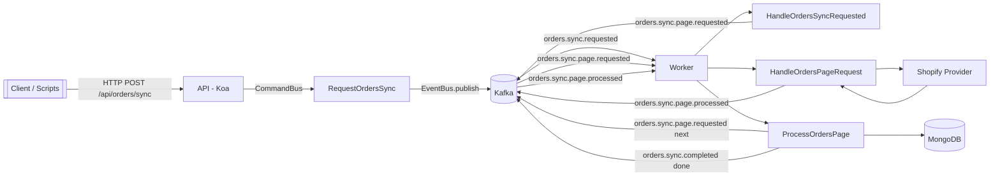
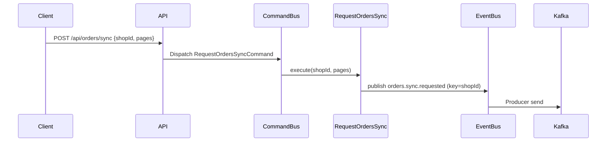
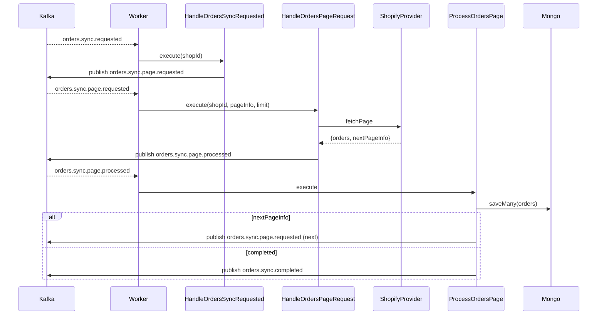
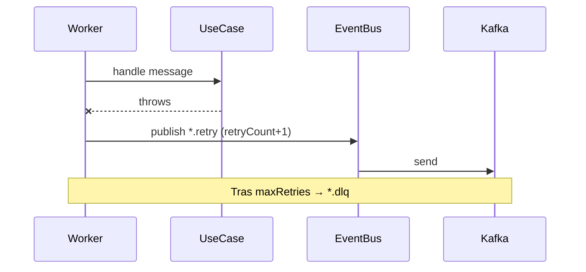
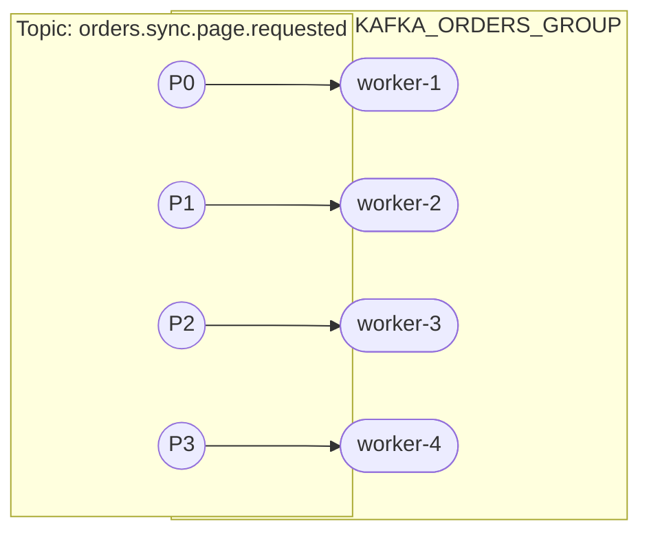
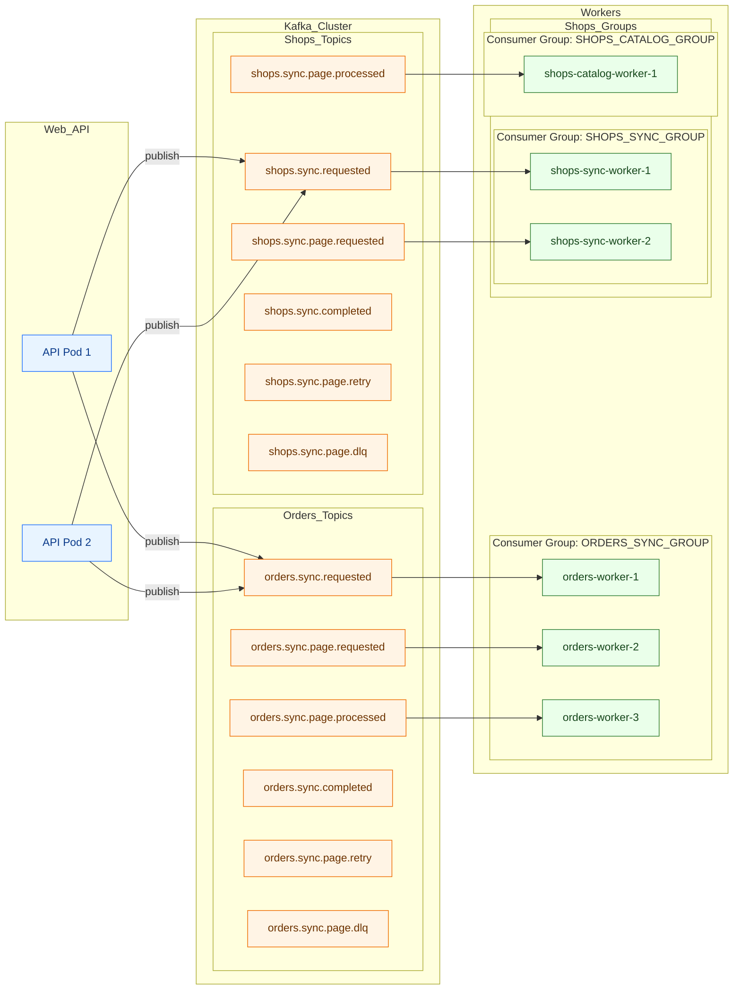
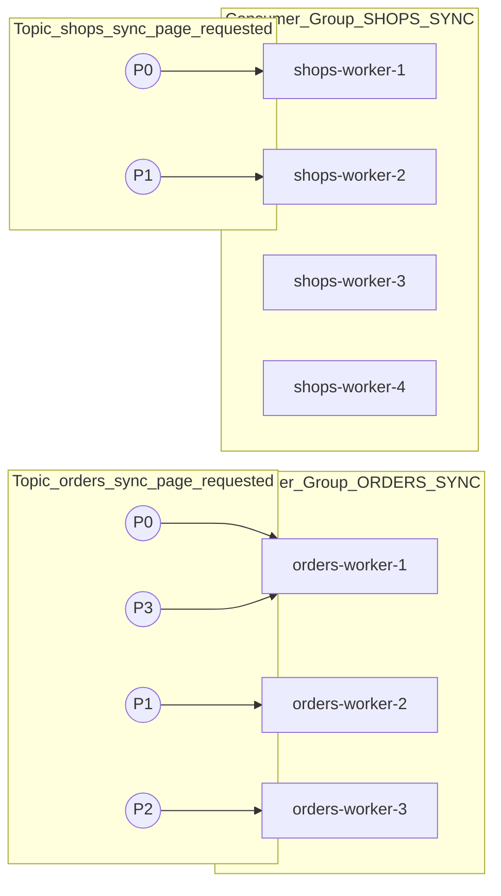

## Ecommerce with Kafka — POC

### Resumen y propósito

Esta POC demuestra cómo usar Kafka como procesador de colas para sincronizar órdenes desde un proveedor ecommerce (Shopify). Se prioriza claridad del flujo end to end (HTTP → eventos → workers → persistencia) y buenas prácticas mínimas de event-driven (orden por clave, consumer groups, retries/DLQ, idempotencia). No busca agnosticismo multi-provider ni escalabilidad extrema; se documenta cómo escalar de forma directa con particiones y réplicas.

### Stack y patrones

- **Node.js**: 22.19.0 (Yarn 4.4.0)
- **TypeScript**, **Koa**, **kafkajs**, **MongoDB**, **Inversify**, **Pino**
- **Arquitectura**: Hexagonal (puertos/adaptadores), DDD, CQRS


## Arquitectura de alto nivel

### Componentes

- **API (`app`)**: expone `POST /api/orders/sync`, encola el pedido de sincronización
- **Workers (`worker`)**: consumen eventos, invocan casos de uso y persisten
- **Kafka**: broker (KRaft), tópicos y consumer groups
- **Kafka UI**: monitoreo de tópicos y consumidores (`http://localhost:8090`)
- **MongoDB**: persistencia de órdenes y jobs de sincronización




## Eventing y piezas fundamentales

### Bus y transporte

- `shared/infrastructure/eventbus/EventBus.ts`
  - Administra suscripciones por tópico (fan out local) y serialización JSON
  - Publica/consume delegando en `EventTransport`

- `shared/infrastructure/eventbus/kafka/KafkaEventTransport.ts`
  - Adaptador Kafka para `EventBus`
  - Convierte `Buffer` a `string` y reenvía a handlers suscritos por tópico

### Producer y consumer

- `shared/infrastructure/eventbus/kafka/KafkaProducer.ts`
  - `allowAutoTopicCreation=false` (los tópicos deben existir)
  - `acks=-1`, compresión GZIP, particionador (consistencia por `key`)

- `shared/infrastructure/eventbus/kafka/KafkaConsumer.ts`
  - Consumer por `groupId`, suscripción múltiple y `eachMessage` con dispatch por tópico

### Workers y middlewares

- `shared/infrastructure/worker/EventWorker.ts`
  - Configura suscripciones y `eventBus.start({ groupId })`

- Middlewares:
  - `IdempotencyMiddleware`: evita reprocesar claves (`shopId|pageInfo`) multiples requests.
  - `DelayMiddleware`: throttling de requests a Shopify o cualquier Integración externa.
  - `RetryMiddleware`: publica en `*.retry` y luego `*.dlq` al exceder `maxRetries`, el topico de dead letter queue y de retry deben tener su propio handler.

### Módulo de órdenes (Shopify)

- `orders/gateway/http`: `POST /api/orders/sync` y Swagger en `/docs/orders`
- `orders/gateway/events/orders-sync.worker.ts`: suscripciones y middlewares
- `orders/infrastructure/adapters/OrdersEventChannels.ts`: nombres de tópicos
- `orders/application/*`: casos de uso (requested → page.requested → page.processed → completed)


## Tópicos de Kafka

Tópicos definidos (auto creación deshabilitada):

```
orders.sync.requested
orders.sync.page.requested
orders.sync.page.processed
orders.sync.completed
orders.sync.page.retry
orders.sync.page.dlq
```

Creación (script/CLI):

```bash
yarn topics:create
# o
bash scripts/create-kafka-topics.sh
```

Recomendación de paralelismo: ajustar particiones ≥ número de réplicas del worker. Mantener `key=shopId` para orden por tienda.

### Aumentar particiones (aprovechar 6 workers)

Para aprovechar 6 pods `worker` en el mismo consumer group, aumenta las particiones de los tópicos de mayor throughput (paginación):

```bash
# Opción A: script (por defecto escala page.requested y page.processed)
yarn topics:scale 6
# o
bash scripts/scale-kafka-partitions.sh 6

# Opción B: especificando tópicos explícitos
bash scripts/scale-kafka-partitions.sh 6 orders.sync.page.requested orders.sync.page.processed
```

Verifica el cambio:

```bash
docker exec ecommerce-with-kafka-kafka-1 /opt/kafka/bin/kafka-topics.sh \
  --bootstrap-server localhost:9092 --describe --topic orders.sync.page.requested
```

Notas importantes:
- Tópicos de baja tasa (`orders.sync.requested`, `orders.sync.completed`, `*.retry`, `*.dlq`) pueden permanecer con 1 partición salvo evidencia de cuello de botella.


## Flujo E2E (secuencia)

### Publicación



### Consumo (pipeline)



### Retries y DLQ (middleware)




## Escalado con consumer groups

- Un consumer group reparte particiones entre réplicas del worker
- Throughput = número de particiones más réplicas que particiones no aumentan procesamiento
- Mantener `key=shopId` para orden por tienda dentro de una partición




## Configuración (.env)

Variables principales (ver `.example.env`):

- Server: `NODE_ENV`, `PORT`
- Kafka: `KAFKA_BROKERS`, `KAFKA_CLIENT_ID`, `KAFKA_ORDERS_GROUP`
- Módulos: `APP_ROLE` (`api`|`workers`), `MODULES_ENABLED`
- Shopify: `SHOPIFY_BASE_URL`, `SHOPIFY_TOKEN`
- Mongo: `MONGO_URI` (Docker lo fija a `mongodb://mongo:27017/orders_db`)

Notas:
- Auto creación de tópicos está deshabilitada (deben crearse antes de publicar)
- Para desarrollo, duplique `.example.env` a `.env` y complete credenciales


## Docker Compose

Servicios:

- `kafka`: broker KRaft (auto create topics: false); expone `9092`
- `kafka-ui`: UI de Kafka (Provectus); `http://localhost:8090`
- `mongo`: `27017` con volumen persistente
- `app`: rol API (Koa); `http://localhost:8080`
- `worker`: rol workers; mismo código, distinto `APP_ROLE`

Arranque completo (infra + app + worker):

```bash
docker compose up -d --build
```

Crear tópicos:

```bash
yarn topics:create
# o
bash scripts/create-kafka-topics.sh
```

Escalar réplicas del worker (con build y selección explícita de servicios):

```bash
docker compose up -d --build --scale worker=4 app worker
```

Cambiar réplicas del worker en caliente:

```bash
# subir a 6
docker compose up -d --scale worker=6 worker
# bajar a 1
docker compose up -d --scale worker=1 worker
```

Apagar y limpiar:

```bash
docker compose down -v
```


## Ejecución local (sin Docker)

Requisitos: Node `22.19.0`, Yarn `4.4.0`, Kafka y Mongo corriendo localmente.

```bash
yarn install

# API
yarn dev:api
# http://localhost:8080

# Workers
yarn dev:workers
```


## Endpoints y pruebas

- Health: `GET /health`
- Swagger: `GET /docs/orders`
- Sincronización: `POST /api/orders/sync` body:

```json
{ "shopId": "my-shop", "pages": 100 }
```

Stress test (alto volumen):

```bash
bash scripts/stress-orders-sync.sh 5000 200 100 http://localhost:8080
```

Qué ocurre al subir/bajar réplicas durante la prueba:
- Al subir réplicas: rebalanceo; mayor paralelismo si existen particiones disponibles
- Al bajar réplicas: rebalanceo inverso; mensajes pendientes permanecen en Kafka; idempotencia evita duplicados
- Con 1 partición, >1 réplica no aumenta throughput (límite por partición)


## Observabilidad y logging

- `pino` con `pino-pretty` en desarrollo; nivel `info` en producción
- Campos clave de log: `topic`, `key`, `groupId`, `shopId`, `pageInfo`
- Kafka UI (`http://localhost:8090`): verificar tópicos, consumidores, offsets y DLQ


## Troubleshooting

- No se crea/encuentra un tópico → crear con `yarn topics:create`; auto-create está deshabilitado
- No se procesan mensajes → verificar `KAFKA_ORDERS_GROUP`, suscripciones del worker y particiones suficientes
- Orden no respetada → asegurar `key=shopId` y mantener las claves estables
- Kafka UI no abre → revisar contenedor `kafka-ui` y puerto `8090`
- Mongo no conecta → revisar `MONGO_URI` y health de `mongo`


## Extender a nuevos módulos (p. ej., shops)

- Definir nuevos tópicos por módulo y un `worker` con su `groupId`
- Asignar particiones según paralelismo deseado (N réplicas → ≥ N particiones)
- Reutilizar `EventWorker` y middlewares (idempotencia, retry, delay)

Cada modulo debe tener su propio worker, cada modulo debe tener sus propios topics, y consumer group diferente

### Separación por módulos/jobs y flujo




### Escalado: particiones vs réplicas por pipeline




## Límites de la POC y próximos pasos

- Fuera de alcance: multi provider real, DLQ y retries con backoff sofisticado, contratos de esquema versionados, seguridad Kafka (SASL/SSL)
